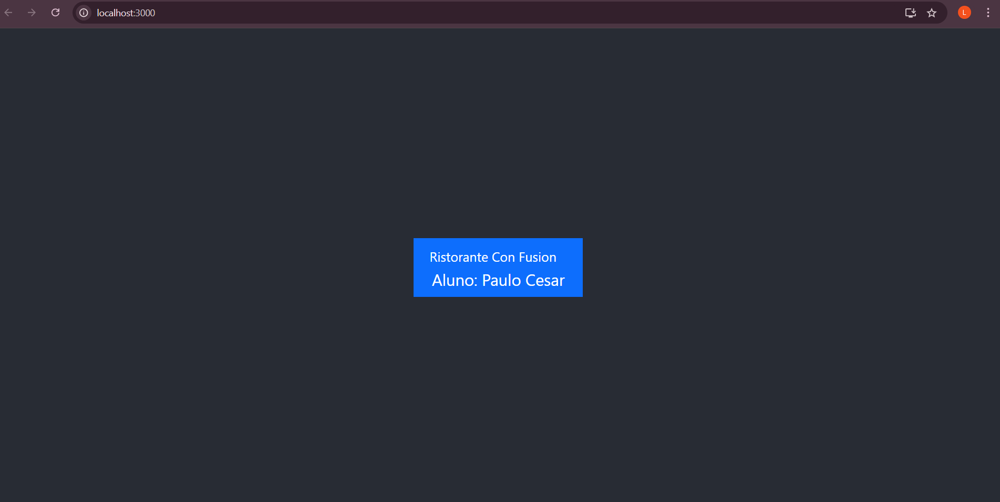

# Projeto React - Confusion

Este é um projeto básico criado com o `create-react-app` para a prática dos primeiros passos no desenvolvimento de aplicativos React. 
## Objetivo

O objetivo deste exercício foi:

1.  Configurar o projeto React para usar o Reactstrap
2. Configurar para usar o Bootstrap
3. Adicionando uma barra de navegação
4. Atualizando o README
5. Subir o projeto para um repositório online (GitHub).

## imagem do meu app.js React

