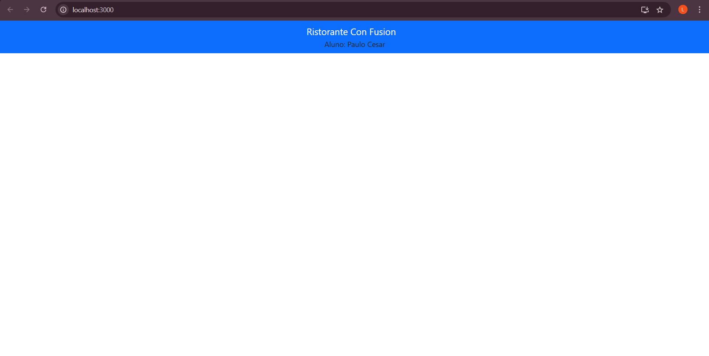

# Projeto React - Confusion

Este é um projeto básico criado com o `create-react-app` para a prática dos primeiros passos no desenvolvimento de aplicativos React. 
## Objetivo

O objetivo deste exercício foi:

1.  Configurar o projeto React para usar o Reactstrap
2. Configurar para usar o Bootstrap
3. Adicionando uma barra de navegação
4. Atualizando o README
5. Subir o projeto para um repositório online (GitHub).

## explicaçao da alteraçao feita no app.js
foi criada uma div com classe com nome app para poder ser identificado no css para a estilizaçao,
Navbar é um componente de barra de navegação do Reactstrap e o dark indica que a barra de navegaçao vai ter um fundo escuro
e o color vai definir a cor da barra de navegaçao.
o hrf usamos para colocar links
e o navbarbranch e usado para definirmos o nome dentro da barra de navegaçao 
a classe container do Bootstrap é usada para centralizar e ajustar oq tem dentro da pagina.

## imagem do meu app.js React

